# 🏗️ CmdAI Architecture & Design

This document provides visual representations and detailed explanations of CmdAI's architecture, component interactions, and design decisions.

## 📊 High-Level Architecture

CmdAI follows an **AI-First Pipeline** architecture with intelligent fallback mechanisms:

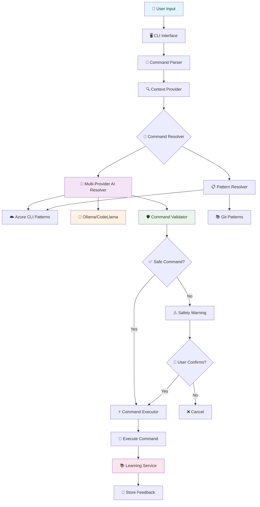

## 🔄 Component Interaction Flow

### Multi-Provider AI Resolution Path

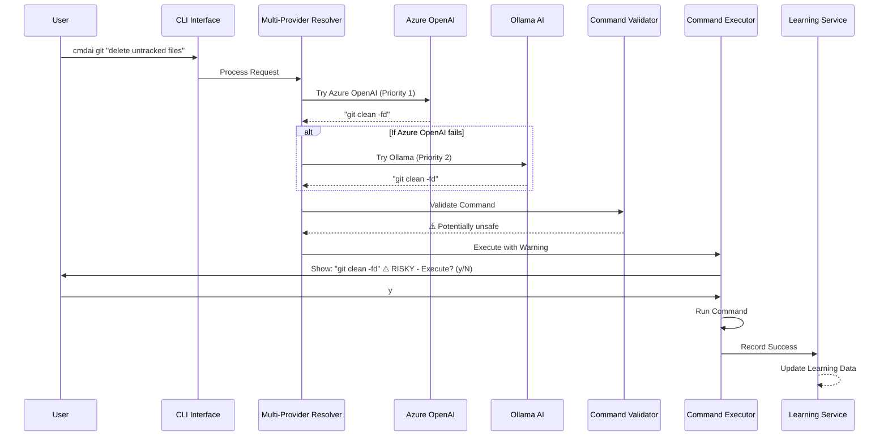

### Fallback Pattern Resolution Path

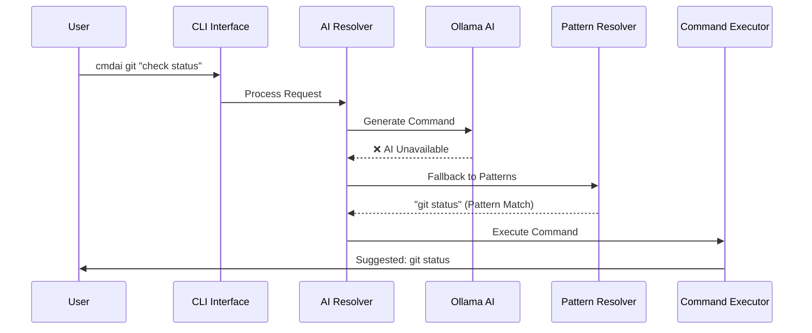

## 🧩 Core Components

### 1. Command Resolution Layer

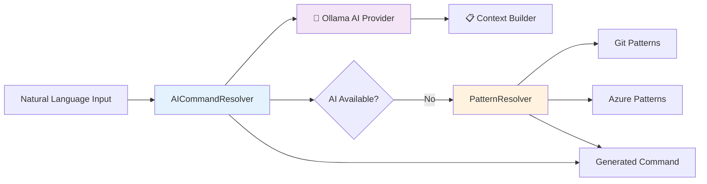

### 2. Safety & Validation System

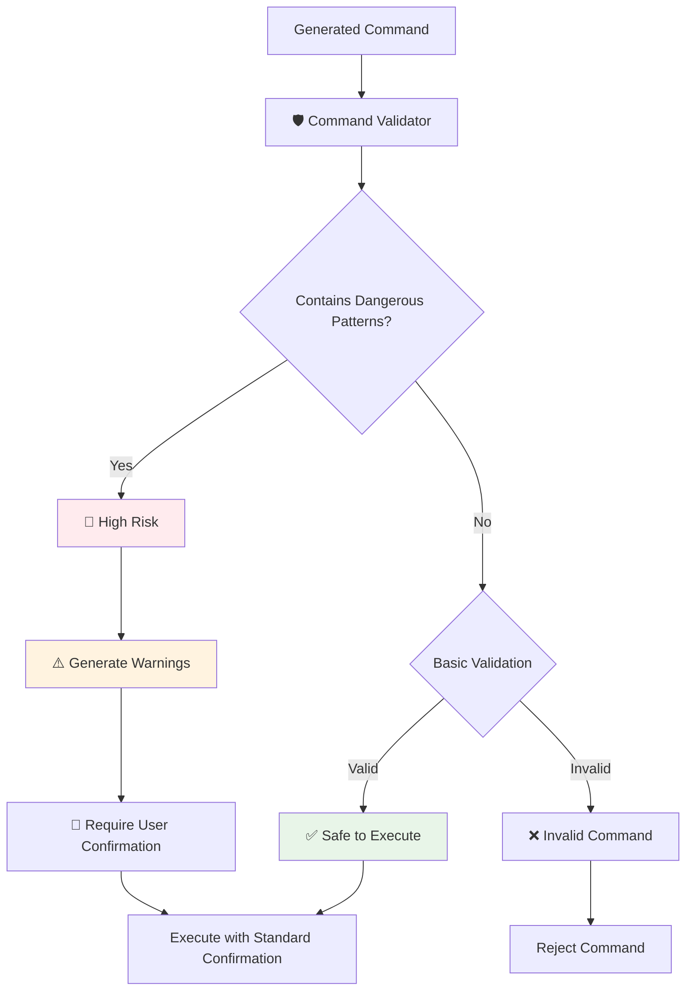

### 3. Learning & Feedback Loop

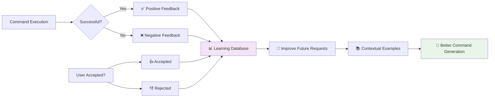

## 🎯 Design Patterns & Principles

### 1. Strategy Pattern - Command Resolvers

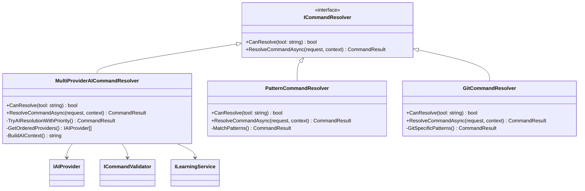

### 2. Dependency Injection Architecture

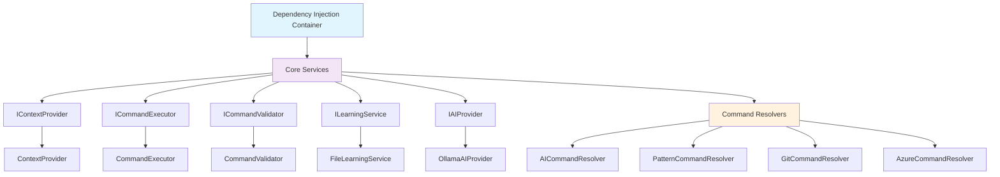

## 🚀 User Experience Flow

### Complete User Journey

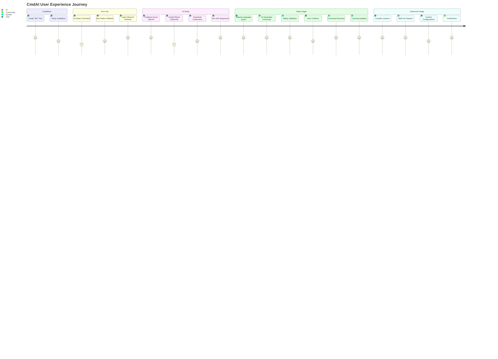

## 🔧 Configuration & Extensibility

### Configuration Flow

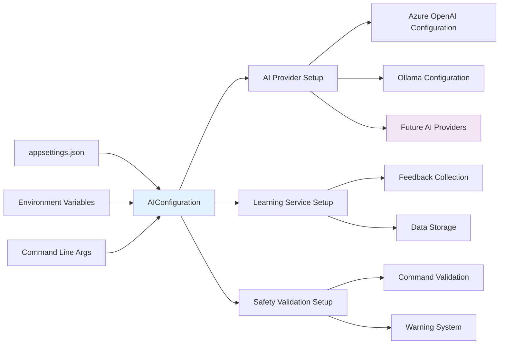

### Extension Points

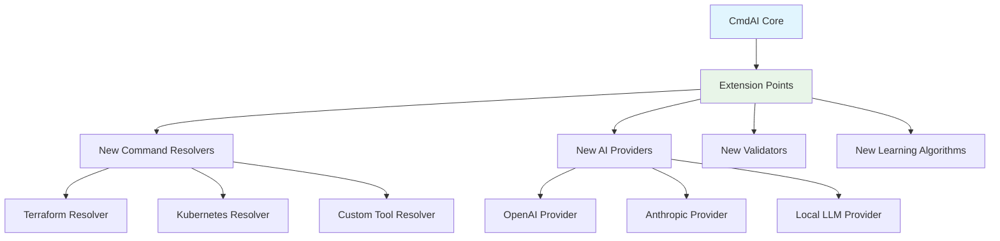

## 📈 Performance & Scalability

### Response Time Optimization

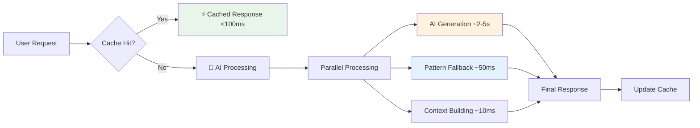

## 🛡️ Security Architecture

### Security Layers

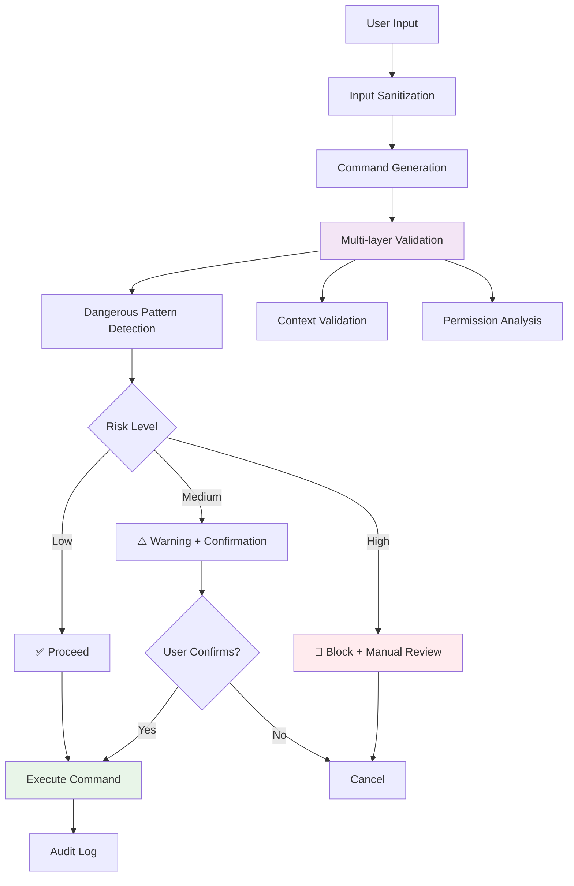

---

## 📚 Further Reading

- **[Implementation Guide](CONTRIBUTING.md)**: How to extend and contribute to CmdAI
- **[API Documentation](cmdai/README.md)**: Detailed usage examples and API reference
- **[Setup Guide](cmdai/OLLAMA_SETUP.md)**: Complete AI setup instructions

This architecture is designed for **extensibility**, **safety**, and **user experience** while maintaining **high performance** and **privacy**.