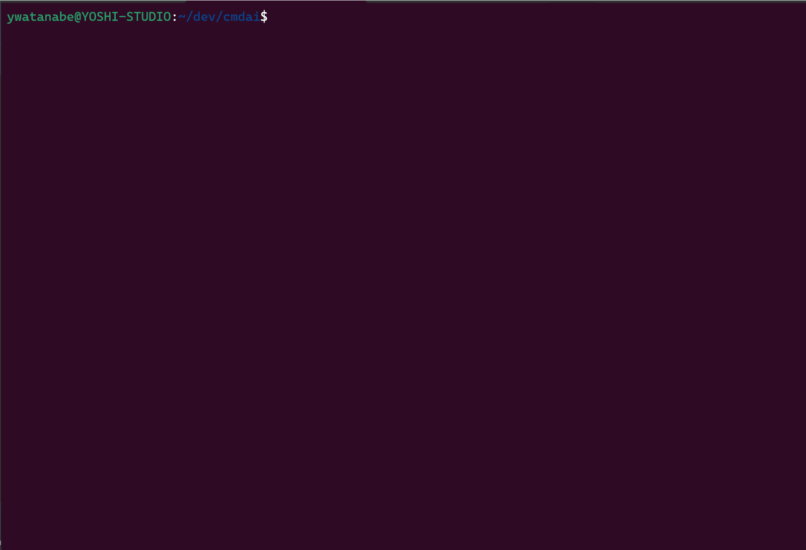

# CmdAI - AI-Powered CLI Assistant

Transform natural language into CLI commands using API-based AI failover.

Default provider chain:
1. OpenAI
2. Azure OpenAI
3. Anthropic Claude
4. Google Gemini
5. Pattern fallback (git/az)



## Install

```bash
dotnet tool install --global --add-source . CmdAi.Cli
```

For a complete setup from `git clone` through installing on both Windows and WSL, see `docs/INSTALL.md`.

Additional docs:
- `docs/SETUP.md`
- `docs/ARCHITECTURE.md`
- `docs/CONTRIBUTING.md`
- `docs/VERSIONING.md`
- `docs/CICD.md` - **CI/CD Setup & Release Guide**

## WSL (Recommended)

If you want `cmdai` to execute commands inside WSL, install it inside WSL (Linux), not as a Windows `.exe`.

From Windows (build the tool package):

```powershell
dotnet pack .\src\CmdAi.Cli\CmdAi.Cli.csproj -c Release
```

Then from WSL (install from the Windows-mounted nupkg folder):

```bash
dotnet tool install --global --add-source /mnt/c/Users/tsuyo/Repos/cmdai/src/CmdAi.Cli/nupkg CmdAi.Cli
export PATH="$PATH:$HOME/.dotnet/tools"
cmdai --version
```

## Configure

Create `~/.env` from `.env.example` and set at least your OpenAI key:

```bash
AI__OpenAI__ApiKeys__0=your_openai_key
```

Optional additional fallbacks:

```bash
AI__AzureOpenAI__Endpoint=https://your-resource.openai.azure.com/openai/v1/
AI__AzureOpenAI__Model=DeepSeek-R1-0528
AI__AzureOpenAI__ApiKeys__0=your_azure_key
AI__Anthropic__ApiKeys__0=your_anthropic_key
AI__Gemini__ApiKeys__0=your_gemini_key
```

Provider priority is configurable:

```bash
AI__Providers__0=openai
AI__Providers__1=azureopenai
AI__Providers__2=anthropic
AI__Providers__3=gemini
```

## Usage

```bash
cmdai "I'm on WSL and need to find CONFIG_ROOT in .ts files recursively"
cmdai --query "with git, how do I show remote repo urls?"
cmdai git "delete untracked files"
cmdai az "list subscriptions"
cmdai docker "show running containers"
cmdai kubectl "get pods"
```

Memory controls:

```bash
cmdai memory add "dotnet pack .\\src\\CmdAi.Cli\\CmdAi.Cli.csproj -c Release"
cmdai memory list --limit 20
cmdai memory clear
```

## Diagnostics

```bash
cmdai diagnostics
```

This reports provider chain, availability, last failover trace, and last memory-query trace.

## Notes

- CmdAI no longer uses local LLM/Ollama.
- Failover across providers happens on transient errors (timeout/network/429/5xx).
- Pattern fallback is used if all providers fail and fallback is enabled.

## License

MIT
