# 🤖 CmdAI - AI-Powered CLI Assistant

[](https://dotnet.microsoft.com/download)
[](https://opensource.org/licenses/MIT)
[](https://www.nuget.org/packages/CmdAi.Cli)

> An intelligent CLI assistant that translates natural language to CLI commands using local AI models with reliable pattern-matching fallback. Supports **ANY** command-line tool with learning capabilities.

## 🚀 Quick Start

### Installation
```bash
# Install CmdAI as a global .NET tool
dotnet tool install --global CmdAi.Cli

# Verify installation
cmdai --version
```

### Basic Usage
```bash
# Works with ANY CLI tool - powered by local AI with pattern fallback
cmdai ask git "check the status"          → git status
cmdai git "undo last commit"              → git reset --soft HEAD~1  
cmdai ask docker "show running containers" → docker ps
cmdai kubectl "get all pods in default namespace" → kubectl get pods -n default

# Azure CLI commands  
cmdai ask az "list subscriptions"         → az account list --output table
cmdai az "show current subscription"      → az account show
```

## ✨ Key Features

- **🤖 AI-Powered**: Local AI models generate commands for ANY CLI tool
- **🛡️ Safety First**: Command validation and dangerous operation detection  
- **🔄 Smart Fallback**: Reliable pattern matching when AI is unavailable
- **📚 Continuous Learning**: Improves from your usage patterns and feedback
- **🔒 Privacy Focused**: All processing happens locally - no data sent to cloud
- **⚡ Context Aware**: Detects git repositories and working directory
- **🌐 Universal Support**: Works with git, docker, kubectl, npm, az, and more
- **🚀 Cross-platform**: Works on Windows, macOS, and Linux

## 📖 Documentation

| Document | Description |
|----------|-------------|
| **[Installation & Setup](cmdai/README.md)** | Comprehensive setup guide and usage examples |
| **[Ollama Setup](cmdai/OLLAMA_SETUP.md)** | Complete guide for AI integration with local models |
| **[Architecture & Design](ARCHITECTURE.md)** | Visual diagrams and technical architecture details |
| **[Versioning Guide](VERSIONING.md)** | Development workflow and release process |

## 🛠️ AI Setup (Optional but Recommended)

For AI-powered features, install Ollama with CodeLlama:

```bash
# Install Ollama
curl -fsSL https://ollama.ai/install.sh | sh

# Download CodeLlama model
ollama pull codellama:7b

# Start Ollama service
ollama serve  # Runs on localhost:11434
```

**📖 See [OLLAMA_SETUP.md](cmdai/OLLAMA_SETUP.md) for detailed installation instructions**

Without AI setup, CmdAI falls back to reliable pattern matching for Git and Azure CLI commands.

## 🏗️ Architecture

**AI-First Pipeline**: User Input → AI Command Resolver → Safety Validation → Execution → Learning Feedback

```mermaid
graph LR
    User[👤 User] --> CLI[🖥️ CLI]
    CLI --> AIResolver[🤖 AI Resolver]
    AIResolver --> Ollama[🦙 Ollama/CodeLlama]
    AIResolver --> Fallback[📋 Pattern Fallback]
    
    AIResolver --> Validator[🛡️ Safety Validator]
    Validator --> Executor[⚡ Executor]
    Executor --> Learning[📚 Learning Service]
    
    style AIResolver fill:#e3f2fd
    style Ollama fill:#f3e5f5
    style Validator fill:#e8f5e8
    style Learning fill:#fce4ec
```



### Core Components
- **`AICommandResolver`**: Primary resolver using local AI models (Ollama/CodeLlama)
- **`PatternCommandResolver`**: Reliable fallback using regex patterns for Git/Azure CLI
- **`CommandValidator`**: Safety checking for dangerous operations
- **`LearningService`**: Continuous improvement from user feedback
- **`OllamaAIProvider`**: Local AI integration with no data leaving your machine

**📊 [View Detailed Architecture](ARCHITECTURE.md)** - Complete diagrams, component interactions, and design patterns

## 📦 Installation Options

### Option 1: .NET Global Tool (Recommended)
```bash
dotnet tool install --global CmdAi.Cli
```

### Option 2: Build from Source
```bash
git clone https://github.com/yoshiwatanabe/cmdai.git
cd cmdai
./scripts/build-dev.sh  # Linux/macOS
# or
.\scripts\build-dev.ps1  # Windows
```

## 🔧 Configuration

CmdAI can be configured via `appsettings.json`:

```json
{
  "AI": {
    "EnableAI": true,
    "Provider": "ollama",
    "ModelName": "codellama:7b",
    "OllamaEndpoint": "http://localhost:11434",
    "TimeoutSeconds": 30,
    "FallbackToPatterns": true,
    "EnableLearning": true,
    "ConfidenceThreshold": 0.7
  }
}
```

## 🤝 Contributing

We welcome contributions! Here's how to get started:

1. **Fork the repository**
2. **Create a feature branch**: `git checkout -b feature/amazing-feature`
3. **Make your changes** and add tests
4. **Run tests**: `dotnet test`
5. **Commit changes**: `git commit -m 'Add amazing feature'`
6. **Push to branch**: `git push origin feature/amazing-feature`
7. **Open a Pull Request**

### Development Setup
```bash
# Clone the repository
git clone https://github.com/yoshiwatanabe/cmdai.git
cd cmdai

# Build and test locally
./scripts/build-dev.sh
cmdai --version
```

## 📝 License

This project is licensed under the MIT License - see the [LICENSE](cmdai/LICENSE) file for details.

## 🔗 Links

- **NuGet Package**: https://www.nuget.org/packages/CmdAi.Cli
- **Issues**: https://github.com/yoshiwatanabe/cmdai/issues
- **Discussions**: https://github.com/yoshiwatanabe/cmdai/discussions

## 🌟 Roadmap

### Current Version: v1.0.0 ✅
- [x] AI integration via Ollama
- [x] Local privacy-focused processing
- [x] Safety validation and learning
- [x] Universal CLI tool support

### Upcoming Features
- [ ] Multi-step command sequences ("deploy my app")
- [ ] Integration with other local AI models (LLaMA, Mistral)
- [ ] Shell integration and auto-completion
- [ ] Web UI for command history management
- [ ] Plugin system for custom resolvers

---

**⭐ Star this repository if you find CmdAI helpful!**