# CmdAI - AI-Powered CLI Assistant

An intelligent CLI assistant that translates natural language to CLI commands using local AI models with reliable pattern-matching fallback. Supports ANY command-line tool with learning capabilities.

## 🚀 What is CmdAI?

CmdAI helps you run CLI commands using natural language. Instead of remembering exact command syntax, just describe what you want to do:

```bash
# Works with ANY CLI tool - powered by local AI with pattern fallback
cmdai ask git "check the status"          → git status
cmdai git "undo last commit"              → git reset --soft HEAD~1  
cmdai ask docker "show running containers" → docker ps
cmdai kubectl "get all pods in default namespace" → kubectl get pods -n default

# Azure CLI commands  
cmdai ask az "list subscriptions"         → az account list --output table
cmdai az "show current subscription"      → az account show
cmdai ask az "list storage accounts"      → az storage account list --output table
cmdai ask az "create resource group MyRG" → az group create --name "MyRG" --location eastus

# Even tools without pre-defined patterns work via AI
cmdai ask npm "install package as dev dependency" → npm install --save-dev
cmdai yarn "show outdated packages" → yarn outdated
```

## 🏗️ Architecture

**AI-First Pipeline**: User Input → AI Command Resolver → Safety Validation → Execution → Learning Feedback

```mermaid
flowchart TD
    A[👤 User Input] --> B[🖥️ CLI Interface]
    B --> C{🤖 AI Available?}
    C -->|Yes| D[🧠 AI Command Resolver]
    C -->|No| E[📋 Pattern Resolver]
    
    D --> F[🛡️ Safety Validator]
    E --> F
    F --> G[⚡ Command Executor]
    G --> H[📚 Learning Service]
    
    style D fill:#e3f2fd
    style E fill:#fff3e0
    style F fill:#e8f5e8
    style H fill:#fce4ec
```



### Core Components
- **`AICommandResolver`**: Primary resolver using local AI models (Ollama/CodeLlama)
- **`PatternCommandResolver`**: Reliable fallback using regex patterns for Git/Azure CLI
- **`CommandValidator`**: Safety checking for dangerous operations
- **`LearningService`**: Continuous improvement from user feedback
- **`OllamaAIProvider`**: Local AI integration with no data leaving your machine

**📊 [View Detailed Architecture](../ARCHITECTURE.md)** - Complete technical diagrams and design patterns

### AI-Powered Features ✨
- **Universal Tool Support**: Works with any CLI tool via AI understanding
- **Smart Fallback**: Falls back to proven patterns when AI is unavailable
- **Safety First**: Validates and warns about potentially dangerous commands
- **Continuous Learning**: Improves suggestions based on your usage patterns
- **Privacy Focused**: All AI processing happens locally via Ollama

## 📖 CLI Syntax

```bash
# Ask syntax - explicit tool specification
cmdai ask git "how do I check status"
cmdai ask az "list subscriptions"
cmdai ask az "list resources in myResourceGroup"

# Direct syntax - tool name as command  
cmdai git "undo last commit"
cmdai az "show current subscription"
cmdai azure "list storage accounts"
```

## ✨ Features

- **🤖 AI-Powered**: Local AI models generate commands for ANY CLI tool
- **🛡️ Safety First**: Command validation and dangerous operation detection  
- **🔄 Smart Fallback**: Reliable pattern matching when AI is unavailable
- **📚 Continuous Learning**: Improves from your usage patterns and feedback
- **🔒 Privacy Focused**: All processing happens locally - no data sent to cloud
- **⚡ Context Aware**: Detects git repositories and working directory
- **🌐 Universal Support**: Works with git, docker, kubectl, npm, az, and more
- **🚀 Cross-platform**: Works on Windows, macOS, and Linux

## 🛠️ Installation & Usage

### Prerequisites
- .NET 8.0 SDK or later
- **For AI features**: [Ollama](https://ollama.ai) with CodeLlama model
  
  **📖 Complete Setup Guide**: See [OLLAMA_SETUP.md](OLLAMA_SETUP.md) for detailed installation instructions
  
  **Quick Start:**
  ```bash
  # Install Ollama and download CodeLlama
  curl -fsSL https://ollama.ai/install.sh | sh
  ollama pull codellama:7b
  ollama serve  # Runs on localhost:11434
  ```

### Build & Run
```bash
# Clone the repository
git clone https://github.com/yourusername/cmdai.git
cd cmdai

# Build the project
dotnet build

# Run examples
dotnet run --project src/CmdAi.Cli -- ask git "status command"
dotnet run --project src/CmdAi.Cli -- git "undo last commit"
dotnet run --project src/CmdAi.Cli -- ask az "list subscriptions"
dotnet run --project src/CmdAi.Cli -- az "show current subscription"
```

### Install as Global Tool (Future)
```bash
dotnet tool install -g cmdai
cmdai ask git "status command"
```

## 📋 Supported Commands

### Git Commands
| Natural Language | Generated Command | Description |
|------------------|-------------------|-------------|
| "status command", "check status" | `git status` | Show working tree status |
| "undo last commit" | `git reset --soft HEAD~1` | Undo last commit, keep changes staged |
| "add all files" | `git add .` | Stage all changes |
| "commit changes" | `git commit` | Create a new commit |
| "show history" | `git log --oneline` | Show commit history |
| "what changed" | `git diff` | Show file differences |
| "push changes" | `git push` | Push to remote repository |
| "pull changes" | `git pull` | Pull from remote repository |

### Azure CLI Commands
| Natural Language | Generated Command | Description |
|------------------|-------------------|-------------|
| "list subscriptions" | `az account list --output table` | List all available subscriptions |
| "show current subscription" | `az account show` | Show current subscription details |
| "switch subscription" | `az account set --subscription` | Switch to a specific subscription |
| "list resource groups" | `az group list --output table` | List all resource groups |
| "create resource group MyRG" | `az group create --name "MyRG" --location eastus` | Create a new resource group |
| "list resources in MyRG" | `az resource list --resource-group "MyRG" --output table` | List resources in resource group |
| "list storage accounts" | `az storage account list --output table` | List all storage accounts |
| "list virtual machines" | `az vm list --output table` | List all virtual machines |
| "list web apps" | `az webapp list --output table` | List all web apps |
| "list key vaults" | `az keyvault list --output table` | List all key vaults |
| "list locations" | `az account list-locations --output table` | List all available Azure regions |
| "login" | `az login` | Login to Azure |

## 🔮 Roadmap

### Phase 1: Pattern-Based MVP ✅
- [x] Core architecture and interfaces
- [x] System.CommandLine integration  
- [x] Git command pattern matching (15+ patterns)
- [x] Azure CLI command pattern matching (25+ patterns)
- [x] User confirmation workflow
- [x] Context awareness (git repo detection)
- [x] Composite resolver supporting multiple tools

### Phase 2: AI Integration ✅ **COMPLETED**
- [x] **Local AI integration via Ollama**
- [x] **CodeLlama model for command generation**
- [x] **Smart fallback to pattern matching**
- [x] **Command safety validation**
- [x] **Learning from user feedback**
- [x] **Universal CLI tool support**
- [x] **Privacy-focused local processing**

### Phase 3: Enhanced AI Features (Next)
- [ ] Multi-step command sequences ("deploy my app")
- [ ] Command explanation and learning modes
- [ ] Integration with other local AI models (LLaMA, Mistral)
- [ ] Web UI for command history and learning management
- [ ] Plugin system for custom command resolvers
- [ ] Shell integration and auto-completion

## 🤝 Contributing

Contributions are welcome! The codebase is designed to be easily extensible:

1. **Adding new AI providers**: Implement `IAIProvider` for your preferred model
2. **Adding patterns**: Extend pattern lists in existing resolvers for better fallback
3. **Improving safety**: Add validation rules in `CommandValidator`
4. **Enhancing learning**: Improve the feedback loop in `LearningService`

## ⚙️ Configuration

CmdAI can be configured via `appsettings.json`:

```json
{
  "AI": {
    "EnableAI": true,
    "Provider": "ollama",
    "ModelName": "codellama:7b",
    "OllamaEndpoint": "http://localhost:11434",
    "TimeoutSeconds": 30,
    "FallbackToPatterns": true,
    "EnableLearning": true,
    "ConfidenceThreshold": 0.7
  }
}
```

## 📄 License

MIT License - see LICENSE file for details

## 🏗️ Project Structure

```
src/
├── CmdAi.Core/           # Core interfaces and models
│   ├── Interfaces/       # ICommandResolver, ICommandExecutor, etc.
│   ├── Models/          # CommandRequest, CommandResult, etc.
│   └── Services/        # Implementation classes
├── CmdAi.Cli/           # Console application
└── tests/
    └── CmdAi.Tests/     # Unit tests
```