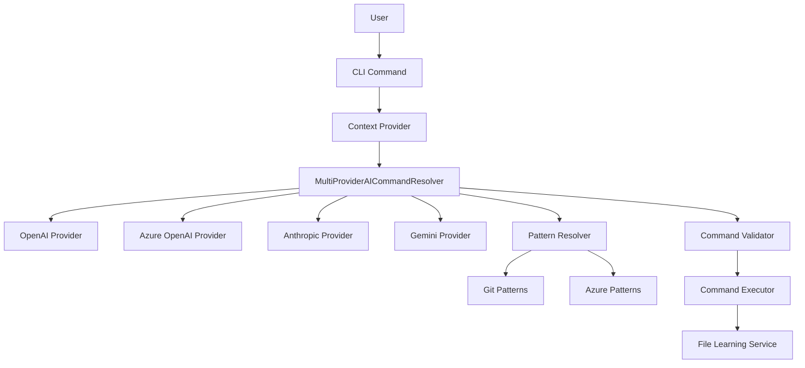
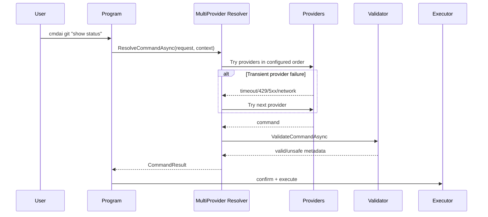

# CmdAI Architecture

CmdAI is a .NET CLI that translates natural language into CLI commands with API-provider failover and pattern fallback.

## High-Level Flow

## Provider Strategy

Default provider order:
1. `openai`
2. `azureopenai`
3. `anthropic`
4. `gemini`

Failover policy:
- Continue to next provider on transient failures only: `timeout`, `network`, `429`, `5xx`.
- Stop provider-chain failover on permanent errors (invalid request/config/auth not recoverable by retry strategy).
- If all providers fail and `FallbackToPatterns=true`, use pattern resolver.

## Core Components

### Resolver Layer
- `MultiProviderAICommandResolver`
- `PatternCommandResolver`
- `GitCommandResolver`
- `AzureCommandResolver`

### AI Provider Layer
- `OpenAIProvider`
- `AzureOpenAIProvider`
- `AnthropicProvider`
- `GeminiProvider`

### Safety + Execution
- `CommandValidator`
- `CommandExecutor`

### Context + Learning
- `ContextProvider`
- `FileLearningService`

## Configuration Model

Configuration is centered on `AIConfiguration` with provider-specific settings:
- `AI.Providers[]` ordered provider IDs
- `AI.OpenAI`, `AI.AzureOpenAI`, `AI.Anthropic`, `AI.Gemini`
- Per-provider `Enabled`, `Endpoint`, `Model`, `ApiKeys[]`, optional timeout override

Compatibility behavior:
- Legacy provider value `ollama` is ignored and surfaced as a warning.
- Legacy Azure fields map into `AI.AzureOpenAI` when needed.
- Optional single-key compatibility fields can seed provider key arrays.

## Diagnostics

`cmdai diagnostics` reports:
- Effective provider order
- Provider enablement and config status
- Provider availability checks
- Last resolution failover trace (provider-by-provider attempt outcomes)

## Dependency Injection

Runtime wiring in `Program.ConfigureServices()`:
- Registers provider `HttpClient`s and `IAIProvider` implementations
- Registers `ICommandResolver` as `MultiProviderAICommandResolver`
- Registers `IResolutionDiagnostics` from the same resolver instance

## Sequence: Request Resolution

## Extension Points

- Add a provider by implementing `IAIProvider` and registering in DI.
- Add tool fallback behavior by extending pattern resolvers.
- Add richer policy by extending provider failure classification and resolver decision rules.

## References

- `../README.md`
- `SETUP.md`
- `CONTRIBUTING.md`
